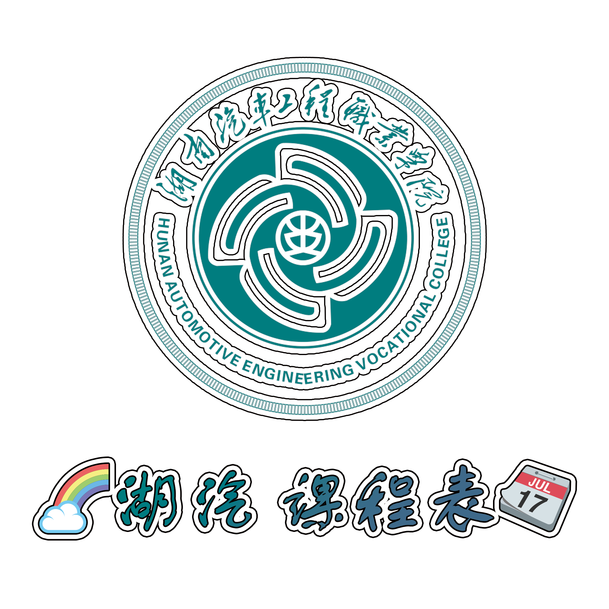

# 湖汽 课程表 项目 (Go语言重构)

[]()

[English Docs(暂无)]() | [中文文档]()

## 用法

```shell
go build
chmod +x HQ_Course
./HQ_Course
```

## 项目结构

```shell
Project
├──data
│     └── ... # 课表数据
├── go.mod
├── go.sum
├── main.go  # 入口 主文件
├── README.MD
├── static # 静态文件
│         ├── favicon.ico
│         └── logo
│         └── logo.png
└── templates  # Go Gin html 模板
    ├── courseTable.html
    ├── index.html
    └── search.html

```

